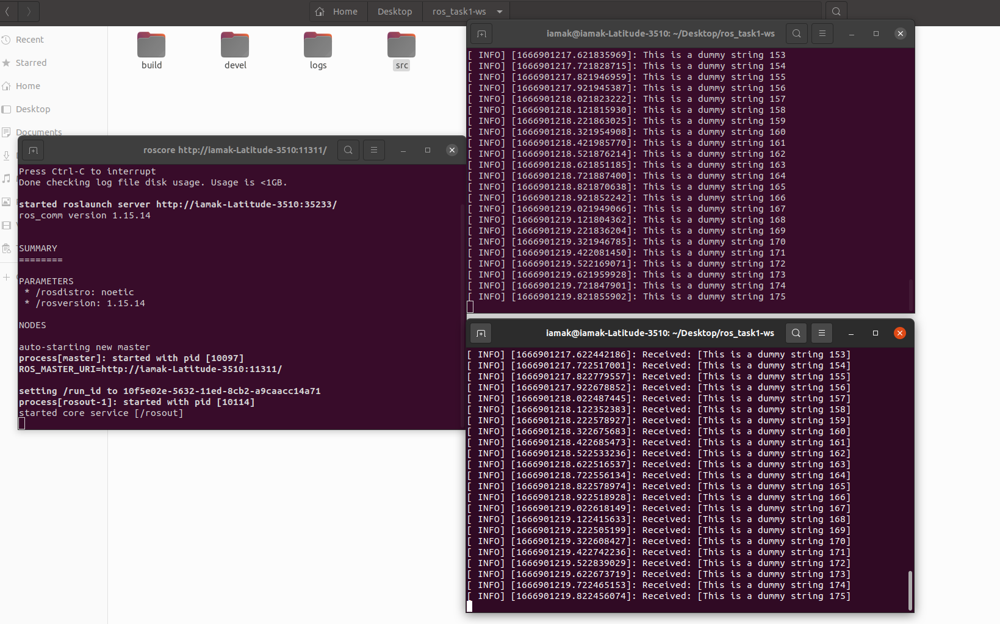

# ROS_Publisher-Subscriber
A simple ROS publisher-subscriber nodes implementation

## How to run
- In a terminal, run  
`roscore`    
- In a separate terminal, move to the ROS_Publisher-Subscriber directory, and then run
```bash
source ./devel/setup.bash
rosrun pub_sub publisher_node
 ```
 - In another separate terminal, after moving to the ROS_Publisher-Subscriber directory, run
 ```bash
 source ./devel/setup.bash
 rosrun pub_sub subscriber_node
 ```
   
 ### Sample output
 
